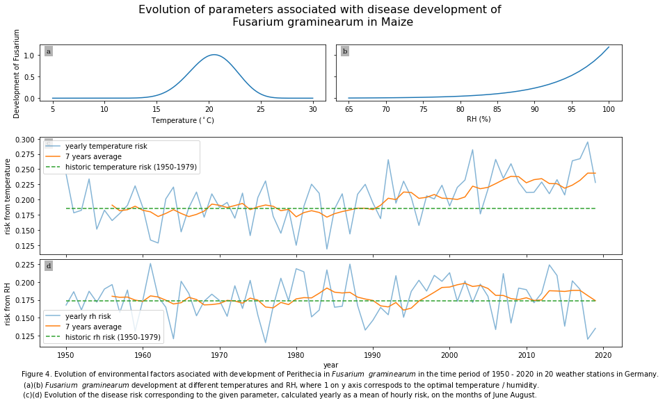
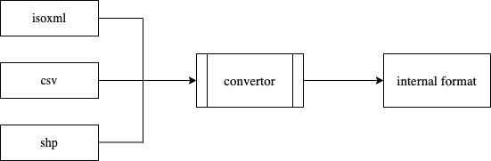
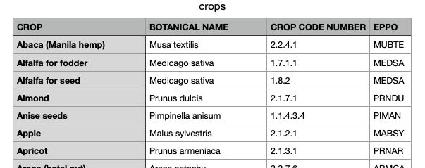
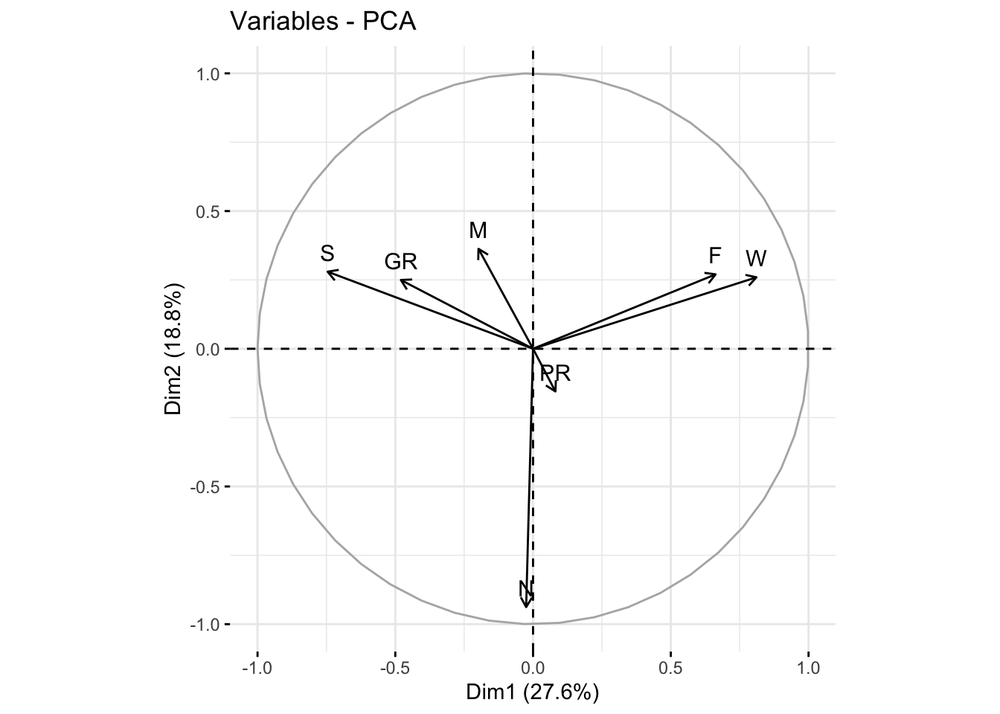
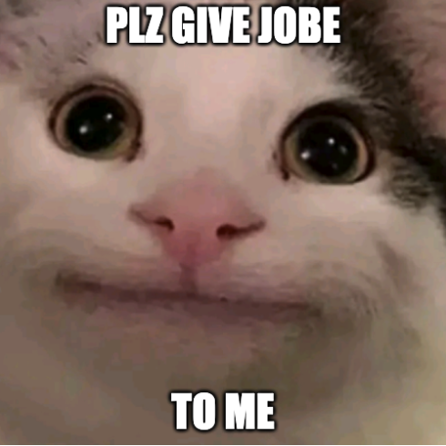

### About me:
A data scientist in becoming, specialized in Life Sciences, always looking for new ways to derive meaningful information from data in order to create a more sustainable and equitable future for everyone.

## Python

### Project 1: Effects of climate change on plant disease enviornmental parameters (Master's Thesis)
Links: &nbsp; [Interactive app (python Dash)](https://planthealth2022-serban.herokuapp.com/) &nbsp; | &nbsp;[Results (jupyter notebook)](https://github.com/serbanradulescu/master_thesis/blob/main/project.ipynb) &nbsp; | &nbsp;  [Code (github)](https://github.com/serbanradulescu/master_thesis)

 [WORK IN PROGRESS] 

* accessing publicly available weather data for Germany (1950 - present) trough an API
* choosing, cleaning, selecting needed datasets
* visualising position of different weather station

To do:
* apply different leaf wetness models on the datasets
* study the disease risk evolution in the last 70 years

 

### Project 2: Automatizing imports from customers' agricultural enterprise [private repository]
* importing different types of files (shp, csv, iso-xml etc.) and converting them into the internal structure
* improving the internal structure for storing and accessing data
* creating a database and matching imported objects trough feature engineering
* keeping the database up to date while improving the matching efficacy

 
 
 
 
### [Project 3: Web scraping and API accessing FAO EPPO](https://github.com/serbanradulescu/web_scraping_and_API_accessing_FAO_EPPO)

* web scrape a table with crop names (in English and latin) from FAO website
* get the EPPO code from the API using the latin name
* merge all the data in a dataframe, export it as a csv

 

 

## R

### Project 4: Replicating the results of a published research (University project) 
Links: [Results (HTML page)](https://htmlpreview.github.io/?https://github.com/serbanradulescu/dataproject/blob/main/Final-results.html) &nbsp; | &nbsp;  [Code (github repository)](https://github.com/serbanradulescu/dataproject)

* replicating the results of: [Effects of chronic exposure to thiamethoxam on larvae of the hoverfly *Eristalis tenax (Diptera, Syrphidae)*](https://peerj.com/articles/4258/) - a study on the effect of insecticides on pollinators
* project made in collaboration with 3 classmates from PlantHealth Master's program
* statistical methods applied: ANOVA, Shapiro, Kruskal-Wallis
* visualisation methods: Kaplan-Meier curves, elipses, Heatmap , Correlation circle

Fig. 2.3: Correlation circle between the 7 different behaviours. Variables grouped together are corelated, while the arrows closer to the circle are better explained by the two dimensions of the PCA. (F,W correlated; S, GR correlated; M-PR negatively correlated but PR is not well explained by the two dimensions)
Keys: S - stationary, GR - grooming, W - walking, F - flying, PR - probing, N - feeding(nutrition), M - moving

 
 

## SQL
### Project 5: Create and maintain a database for agriculture products, processes and crops (SQLite) [private repository]

* create a relational database that would correspond to company's needs
* import and adapt the data from currently in use data formats (csv, json) while setting the right foreign keys
* implement the database in production (Rshiny app) without disturbing the current functionalities of the product

### Courses and certificates

* [SQL for Datascience](https://www.coursera.org/account/accomplishments/verify/KF9V6CH5GP6Q)  

<!--

Details

* Identify a subset of data needed from a column or set of columns and write a SQL query to limit to those results.

* Use SQL commands to filter, sort, and summarize data.

* Create an analysis table from multiple queries using the UNION operator.

* Manipulate strings, dates, & numeric data using functions to integrate data from different sources into fields with the correct format for analysis.

 
 -->
* [Applied Machine Learning in Python](https://www.coursera.org/account/accomplishments/verify/YA7S96MHRFN9) 
  
<!--
  

Details

* Describe how machine learning is different than descriptive statistics

* Create and evaluate data clusters

* Explain different approaches for creating predictive models

* Build features that meet analysis needs
 

  
-->

* [Applied Plotting, Charting & Data Representation in Python](https://www.coursera.org/account/accomplishments/verify/9XYPE8NM8C5T)

* [Statistics with Python](https://www.coursera.org/account/accomplishments/verify/AKN28MBU38TL) 

* Google Data Analytics Professional Certificate - [WORK IN PROGRESS]

<!--

Details

* Describe what makes a good or bad visualization

* Understand best practices for creating basic charts

* Identify the functions that are best for particular problems

* Create a visualization using matplotlb

More
 

-->
 
 
 

### Areas of improvements

It takes a lot of strength to admit your weaknesses. However, admitting your shortcomings is the first step to self-improvement.
 
* technical
  * take more advantage of python packages
  * improve git commit etiquette
  * better markdown skills ( this pages serves as an example )

* soft-skills
  * presenting progress to non-technical stakeholders
  * delegating tasks to people  

 
 

### Contact

e-mail: s.radulescu@protonmail.com  
LinkedIn: [Serban Radulescu](https://www.linkedin.com/in/serban-petre-radulescu-6b50121a2/)     

