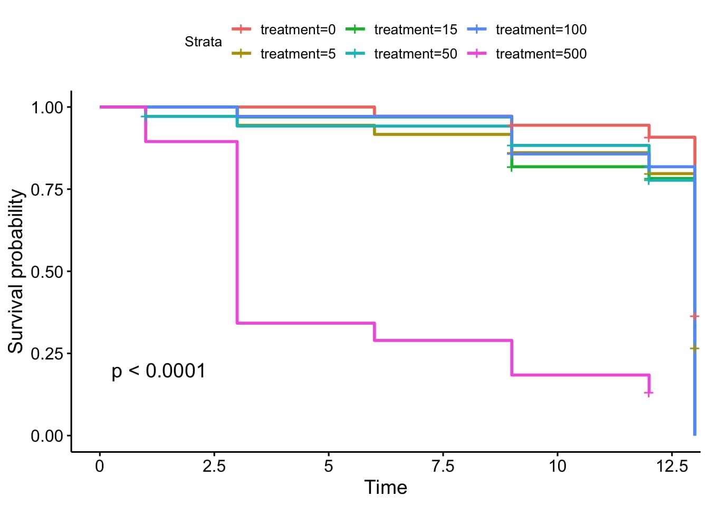

### About me:
A data scientist in becoming, specialized in Life Sciences, always looking for new ways to derive meaningful information from data in order to create a more sustainable and equitable future for everyone.

## Python

### [Project 1: Effects of climate change on plant disease enviornmental parameters (Master's Thesis)](https://github.com/serbanradulescu/master_thesis/blob/main/project.ipynb)

 [WORK IN PROGRESS] 

* accessing publicly available weather data for Germany (1950 - present) trough an API
* choosing, cleaning, selecting needed datasets
* visualising position of different weather station

To do:
* apply different leaf wetness models on the datasets
* study the disease risk evolution in the last 70 years

### Project 2: Automatizing imports from customers' agricultural enterprise [private repository]
* importing different types of files (shp, csv, iso-xml etc.) and converting them into the internal structure
* improving the internal structure for storing and accessing data
* creating a database and matching imported objects trough feature engineering
* keeping the database up to date while improving the matching efficacy

### [Project 3: To be added](www.notyet.com)
* web scraping project, will be added soon

 

## R

### Project 4: Replicating the results of a published research (University project) 
Links: [Results (HTML page)](https://htmlpreview.github.io/?https://github.com/serbanradulescu/dataproject/blob/main/Final-results.html) &nbsp; | &nbsp;  [Code (github repository)](https://github.com/serbanradulescu/dataproject)

* replicating the results of: [Effects of chronic exposure to thiamethoxam on larvae of the hoverfly *Eristalis tenax (Diptera, Syrphidae)*](https://peerj.com/articles/4258/) - a study on the effect of insecticides on pollinators
* project made in collaboration with 3 classmates from PlantHealth Master's program
* statistical methods applied: ANOVA, Shapiro, Kruskal-Wallis
* visualisation methods: Kaplan-Meier curves, elipses, Heatmap , Correlation circle

Figure a3.1. Cumulative survival of *Eristalis tenax* larvae when reared in substrate contaminated with five different concentrations of thiamethoxam, plus control

 
 

### Courses and certificates
 * [SQL for Datascience](https://www.coursera.org/account/accomplishments/verify/KF9V6CH5GP6Q)
 * [Applied Machine Learning in Python](https://www.coursera.org/account/accomplishments/verify/YA7S96MHRFN9)
 * [Applied Plotting, Charting & Data Representation in Python](https://www.coursera.org/account/accomplishments/verify/9XYPE8NM8C5T)

### Contact

serban-petre@mail.com
 
[LinkedIn](https://www.linkedin.com/in/serban-petre-radulescu-6b50121a2/)

